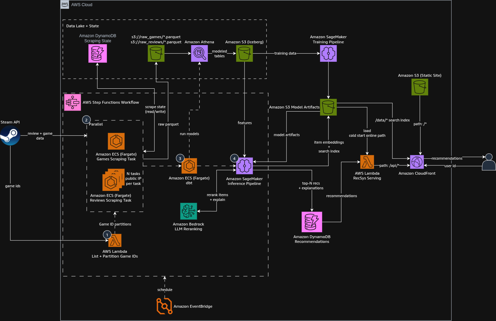

# End-to-end Recommender System for Steam Games

This projects features a full end-to-end AWS based Recommender System, integrating AI coding subagents for each
component, described below:

| COMPONENT NAME | DIRECTORY       | DESCRIPTION                                                                                                                                                                                                                                                                                                                                                                                                                                                          |
|----------------|-----------------|----------------------------------------------------------------------------------------------------------------------------------------------------------------------------------------------------------------------------------------------------------------------------------------------------------------------------------------------------------------------------------------------------------------------------------------------------------------------|
| Data Ingestion | @data_ingestion | Consists on two containerized jobs (games_scraping and reviews_scraping) ,via AWS ECS Tasks, to scrape the Steam API for game info and game reviews given the game id, a lambda function in @data_ingestion/src/steam_ingestion/list_partition_game_ids in order to submit the scraping jobs on multiple workers partitioned by game ids. Scraping state is written into cursors stored in DynamoDB so the scraper can run incremental review and game info scraping |
| ETL            | @etl            | dbt based transformations with AWS Athena backend, running as an ECS Task as well, to perform feature engineering on the raw parquet scraped data, resulting in an Iceberg dataset for offline training and evaluation of retrieval and ranking models.                                                                                                                                                                                                              |
| Training       | @training       | Responsible of taking the processed Iceberg tables from the ETL in order to train the recommender model (currently only retrieval since there is not enough user signal). Output artifacts are the User and Item tower.                                                                                                                                                                                                                                              |
| Inference      | @inference      | Includes the Inference Pipeline which reads the necessary features from the Iceberg Tables, runs the two tower model and reranks the top N items with an LLM, including a natural text paragraph on why the recommendation was chosen                                                                                                                                                                                                                                |
| Serving        | @serving        | Lightweight lambda app to serve the final recommender system. Fetch the recommendations for each user directly from DynamoDB's `game-explainable-recommendations` table (popularity fallback for unknown users), enriched with the `game-details` table, behind a Lambda Function URL (auth `AWS_IAM` or `NONE`)                                                                                                                                                                         |
| Infrastructure | @infrastructure | Necessary AWS infrastructure (terraform), including AWS Lambda for serving, EventBridge to schedule the Step Function to handle the full ingestion to recs pipeline. Since doing batch retrieval recommendation recomputation triggers as new data arrives in batch.                                                                                                                                                                                                 |

## General Outlines

- This project is meant to be entirely serverless, leveraging Infrastructure as Code as much as possible.
- Each feature implemented must also implement is corresponding tests which will be evaluated as a CI gate before any PR
  merge to main.
- Once a feature is completed, the CLAUDE.md file for its subdirectory MUST be updated, as well as a README.md file for
  usage and human readable documentation. Brief, informative, what it does, how to do it.
- Every component must be fully deployable via AUtomated CI/CD Pipelines on github workflows, as part of each spec /
  feature request. CI can run in parallel only in code changes of specific paths. CD manually triggered, separated by
  component.
- All sensitive information such as API Keys or username / passwords must live in AWS Secrets Manager, env variables
  under AWS Parameter Store, with the convention following the directory name (kebab-case) and the env variable name.
  Each component
  needs to be configurable via a common pattern (Pydantic Config) and all contracts / state passed between components be
  validated and enforced with Pydantic models
- GitHub workflows for CI checks and continuous deployment must leverage OIDC authentication with the target AWS
  project. AWS keys are to be entered manually by the user, NEVER read by an LLM.
- All components' images must be stored in Amazon ECR, following the directory name convention (with kebab-case).
- Model promotions will leverage simple model evaluation CI on github workflows. Trigger the evaluation pipeline from
  the workflow, make the eval pipeline write to a bucket, keyed by commit sha (s3://model-artifacts-<account-id>
  -id/evaluation/<commit-sha>/metrics.json. compare with current model metrics.
  If better, replace model-artifacts-<project>-id/evaluation/champion/metrics.json which will hold the best model's
  metrics and swap the model in a similar fashion with the actual model's artifacts.
- Training should be triggered manually with a GH Workflow calling the SageMaker endpoint previous authentication.

## Deployment

Runbook (bootstrap, GitHub repository variables, apply, secrets, component CDs, first run):
[`docs/deployment.md`](docs/deployment.md). Keep it updated when a feature adds infrastructure,
variables or a CD workflow.

## Full Architecture Diagram

## Control flow (Step Functions, triggered by EventBridge schedule)

1. Lambda `list-partition-game-ids`: pulls game IDs from Steam API, emits game ID partitions
2. Parallel (Distributed Maps over the partition files in S3):
    - ECS Fargate `games-scraping` (Distributed Map, 1 task per ≤8k new game ids: 1 task normally, ~17 on the initial
      backfill)
    - ECS Fargate `reviews-scraping` (×N tasks, one per partition; public subnet,
      assignPublicIp=ENABLED, so each task has a distinct egress IP to avoid per-IP throttling)
3. ECS Fargate `dbt`: runs models through Athena
4. SageMaker Inference Pipeline: a SageMaker Processing job `steam-recsys-infer-*` (only when
   `models/champion/` exists, else skipped): top-K recs per user + LLM reranking

Order: EventBridge → 1 → 2 → 3 → 4

## Data flow

### Ingestion

- Steam API → (review + game data) → scraping tasks (2)
- scraping tasks ↔ DynamoDB `game-ids-state`, `reviews-state-cursor` (read/write scrape state)
- scraping tasks → S3 `raw-steam-data-<account-id>/games/*.parquet`, `raw-steam-data-<account-id>/reviews/*.parquet`

### Data lake

- S3 raw parquet (Glue `steam_raw`) → Athena → modeled tables → S3 `processed-steam-data-<account-id>/iceberg/`
  (Glue `steam_staging` / `steam_intermediate` / `steam_marts`)
- dbt (3) runs its models via Athena (workgroup `steam-recsys-etl`)
- Marts for training / inference: `interactions`, `game_features`, `user_features`, `lkp_*` (see `etl/README.md`)

### Training (outside the Step Functions workflow)

- S3 (Iceberg, read with pyiceberg) → SageMaker training job (`training CD`) → S3 `model-artifacts-<account-id>/models/<sha>/`
  (user + item tower); `training promote` evaluates it vs `models/champion/` and swaps it in when better

### Batch inference (4)

- S3 (Iceberg `user_features`, `game_features`, `interactions`) → features → SageMaker Inference Pipeline
- S3 `model-artifacts-<account-id>/models/champion/` → model artifacts → SageMaker Inference Pipeline
- SageMaker Inference Pipeline ↔ Bedrock (LLM reranking + explanations for the most active reviewers)
- SageMaker Inference Pipeline → top-K recs (changed users only) + `__popular__` fallback → DynamoDB
  `game-explainable-recommendations`
- S3 (Iceberg `game_details`) → SageMaker Inference Pipeline → new games only → DynamoDB `game-details`

### Serving (online path)

- User → user id → Lambda Function URL → Lambda `recsys-serving` → reads DynamoDB
  `game-explainable-recommendations` (+ `game-details`) → recommendations → User
- No LB in front of the Lambda; the diagram shows the Lambda called directly (Function URL, auth
  `AWS_IAM` or `NONE`, chosen in the infrastructure CD)

## Not shown (deliberately)

ECR, IAM, VPC/subnets (except the reviews egress note), CloudWatch