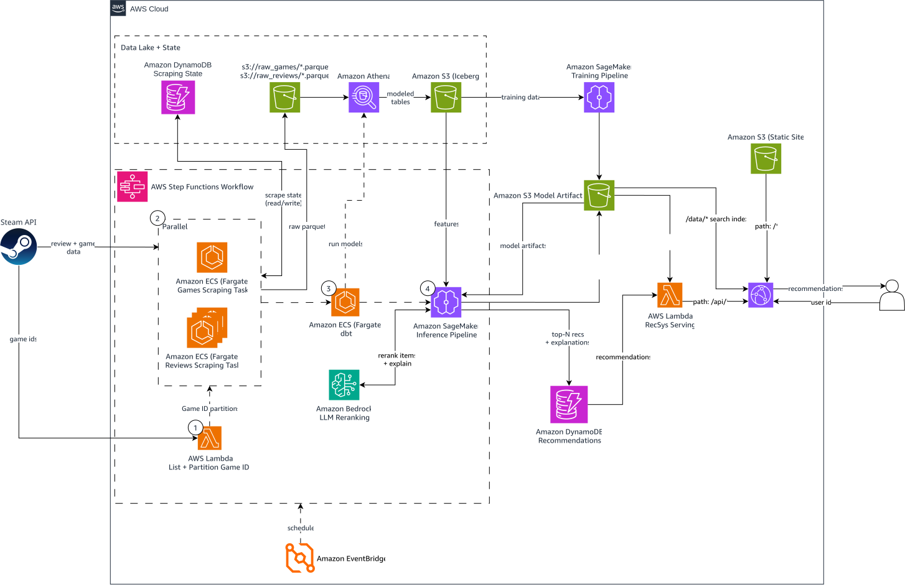

# Sistema de recomendación de juegos de Steam (end-to-end en AWS)

Proyecto demo de un recomendador de juegos de Steam, 100 % serverless y desplegado con
Terraform + GitHub Actions. Cada semana extrae juegos y reseñas de la API de Steam, los
transforma con dbt, calcula recomendaciones con un modelo *two-tower* y las explica con un LLM (Amazon Bedrock). Una
Lambda las sirve por HTTP.

## Arquitectura



Flujo semanal (Step Functions, disparado por EventBridge los jueves):

1. **Ingesta** (`data_ingestion/`): una Lambda reparte los ids de juegos y tareas ECS Fargate
   extraen juegos y reseñas hacia S3 (parquet). El estado incremental vive en DynamoDB.
2. **ETL** (`etl/`): dbt sobre Athena genera tablas Iceberg (interacciones, features de
   usuarios y juegos).
3. **Inferencia** (`inference/`): un job de SageMaker Processing calcula el top 30 de cada
   usuario con el modelo campeón, reordena y explica el de los usuarios más activos con un LLM
   y lo guarda en DynamoDB.
4. **Serving** (`serving/`): una Lambda con Function URL devuelve las recomendaciones de un
   usuario, los juegos populares, o recomendaciones en línea a partir de juegos que te gustan.

El **entrenamiento** (`training/`) va aparte y es manual: un job de SageMaker entrena el modelo
y un workflow de *promote* lo evalúa contra el campeón actual y lo reemplaza si es mejor. La
infraestructura está en `infrastructure/`. El diagrama del modelo *two-tower* (capas y
dimensiones) está en [`training/README.md`](training/README.md#model). Cada carpeta tiene su propio README con los
detalles.

## Costos

Costo real de AWS de todo el proyecto hasta el 25/09/2026 (AWS Cost Explorer; el día más
reciente puede estar incompleto). Incluye la carga inicial completa (~25 M de reseñas, 10,6 M de
usuarios, 176 mil juegos), un entrenamiento en SageMaker y dos corridas de inferencia.

| Servicio                               |       USD | Qué lo genera                                                                            |
|----------------------------------------|----------:|------------------------------------------------------------------------------------------|
| Amazon ECS (Fargate)                   |     11,83 | Tareas de scraping (10 en paralelo durante ~30 h en la carga inicial) y dbt              |
| Amazon DynamoDB                        |      2,17 | Escritura de las recomendaciones (~1,4 M usuarios) y estado del scraping                 |
| Amazon VPC                             |      2,03 | IPs públicas de las tareas Fargate (una por tarea, para no compartir el límite de Steam) |
| Amazon Bedrock                         |      1,76 | Rerank + explicaciones con Nova 2 Lite (1.000 usuarios por corrida)                      |
| Amazon SageMaker                       |      1,52 | Entrenamiento en GPU (`ml.g4dn.xlarge`) e inferencia (`ml.t3.xlarge`)                    |
| Amazon Athena                          |      0,18 | Consultas de dbt                                                                         |
| Amazon S3                              |      0,09 | Datos crudos, Iceberg y modelos                                                          |
| Otros (Secrets Manager, Cost Explorer) |      0,06 |                                                                                          |
| Impuestos                              |      3,53 |                                                                                          |
| **Total**                              | **23,18** |                                                                                          |

Las corridas semanales siguientes son incrementales (solo juegos y reseñas nuevos, solo
usuarios cuyas recomendaciones cambiaron), así que cuestan una fracción de la carga inicial.

## Despliegue desde cero (fork o clon)

Región `us-east-1`. La guía completa, con verificaciones y solución de problemas, está en
[`docs/deployment.md`](docs/deployment.md).

**Requisitos:** una cuenta de AWS con credenciales de administrador en el AWS CLI (solo para el
paso 1; nunca van a GitHub), Terraform >= 1.10, GitHub CLI (`gh auth login`), `uv` y una
[API key de Steam](https://steamcommunity.com/dev/apikey).

### 1. Bootstrap (una vez, local)

Crea el bucket del estado de Terraform y el rol que GitHub Actions asume por OIDC (solo desde
`main`). Si hiciste un fork, cambia `github_repository` y `github_repository_immutable` en
`infrastructure/bootstrap/variables.tf` (los ids salen de
`gh api repos/<owner>/<repo> --jq '.owner.id, .id'`).

```bash
cd infrastructure/bootstrap
terraform init
terraform apply   # agrega -var create_github_oidc_provider=true si la cuenta no tiene el proveedor OIDC de GitHub
```

### 2. Variables del repositorio en GitHub

```bash
gh variable set AWS_ROLE_ARN    --body "$(terraform output -raw github_deploy_role_arn)"
gh variable set TF_STATE_BUCKET --body "$(terraform output -raw tf_state_bucket)"
gh variable set AWS_REGION      --body us-east-1
```

### 3. Infraestructura

Actions → **infrastructure CD** → `action=plan`, revisar, y luego `action=apply`. En
`serving_auth_type` elige `NONE` para una URL pública de demo (o `AWS_IAM` para firmar las
llamadas). El resumen del job muestra la URL de la API (`serving_function_url`).

### 4. API key de Steam

```bash
aws secretsmanager put-secret-value --secret-id data-ingestion/steam-api-key --secret-string '<tu key>'
```

### 5. Desplegar los componentes

Desde `main`, en Actions: **data-ingestion CD** (`target=all`), **etl CD**, **inference CD** y **serving CD**.

### 6. Primera corrida del pipeline

```bash
ARN=$(aws stepfunctions list-state-machines \
  --query "stateMachines[?name=='steam-recsys-pipeline'].stateMachineArn" --output text)
aws stepfunctions start-execution --state-machine-arn "$ARN" --input '{}'
```

La primera corrida es la carga inicial y dura más de un día por los límites de la API de Steam.
Sin un modelo promovido, el paso de inferencia se omite. Después corre sola todos los jueves.

### 7. Entrenar y promover el modelo

1. Pide cuota de SageMaker para entrenamiento (las cuentas nuevas empiezan en 0), por ejemplo
   `ml.g4dn.xlarge for training job usage` en Service Quotas.
2. Actions → **training CD** con `torch_variant=cu128`, `instance_type=ml.g4dn.xlarge` y
   `env_overrides=VALIDATION_FRACTION=0.01 EPOCHS=30 BATCH_SIZE=4096`.
3. Actions → **training promote** con `model_id=<sha del commit entrenado>` e
   `image_tag=<sha>-cu128`. Si el modelo gana, pasa a ser el campeón.

### 8. Generar las recomendaciones

Actions → **inference CD** con `run_now` marcado y
`env_overrides=MAX_USERS=1000000 RERANK_MAX_USERS=2000`. Tarda unas 2,5 h; el límite de
`MAX_USERS` mantiene el job dentro de su máximo de 4 h (todos los usuarios no alcanzan).

### 9. Probar la API

Los ejemplos usan [`jq`](https://jqlang.org/) para formatear el JSON (sin `jq`:
`| python3 -m json.tool`).

```bash
URL=$(aws lambda get-function-url-config --function-name recsys-serving --query FunctionUrl --output text)

# Estado y juegos populares (el fallback para usuarios desconocidos)
curl -s "${URL}health" | jq
curl -s "${URL}popular?limit=5" | jq

# Recomendaciones precalculadas de un usuario (con detalles de cada juego)
curl -s "${URL}users/76561198312196006/recommendations?limit=5" | jq

# Solo puesto, nombre y explicación del LLM
curl -s "${URL}users/76561198312196006/recommendations?limit=5&details=false" \
  | jq '.recommendations[] | {rank, name, explanation}'

# Recomendaciones en línea a partir de juegos que te gustan (Portal 2 y Stardew Valley)
curl -s -X POST "${URL}recommendations" -H 'content-type: application/json' \
  -d '{"liked_game_ids": [620, 413150], "limit": 5, "details": false}' \
  | jq '.recommendations[] | {rank, name}'

# Detalles de un juego
curl -s "${URL}games/620" | jq
```

Usuarios de ejemplo (reseñadores públicos de Steam). El modelo usa sus últimos 5 juegos con
reseña positiva. Los usuarios más activos (`RERANK_MAX_USERS`, 1.000 por defecto) reciben además
el reordenamiento del LLM (`"reranked": true`), con una explicación para las 5 primeras
recomendaciones:

| Steam id            | Qué muestra                                                                                                     |
|---------------------|-----------------------------------------------------------------------------------------------------------------|
| `76561198312196006` | Aventura / indie; 5 explicaciones del LLM basadas en sus juegos (Mad Father, ANNO: Mutationem, Coffin of Ashes) |
| `76561198093868592` | Simulación *cozy*; 5 explicaciones del LLM (Roadhouse Simulator, Tiny Eden)                                     |
| `76561198422199704` | Solo el modelo, sin LLM (juegos *idle* y de granja)                                                             |

Para buscar otros usuarios con explicaciones:

```bash
aws dynamodb scan --table-name game-explainable-recommendations \
  --filter-expression "reranked = :t" --expression-attribute-values '{":t":{"BOOL":true}}' \
  --projection-expression user_id --max-items 10 --query 'Items[].user_id.S' --output text
```

Un id desconocido recibe la lista popular (`"source": "popular"`). El detalle de cada endpoint
está en [`serving/README.md`](serving/README.md).
