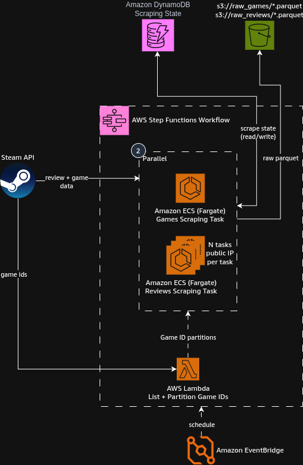

## Spec 1: Steam Games Scraping

First feature consists in deploying an incremental and idempotent data ingestion pipeline for Steam Games information +
reviews,
scheduled by Amazon EventBridge and triggered as part of an AWS Step Function (even if being just one step it will be
useful for the next features).

### Component Specification

Concretely the full implementation would consists of the initial part of the diagram:


### AWS Lambda (List + Partition Game IDs)

Receive the runid from the Step Function
Fetches `GET https://api.steampowered.com/IStoreService/GetAppList/v1/` endpoint, which requires an API Key (use AWS
Secret Manager to store it, include a fallback if using local dev to test it directly and for testing purposes),
filtering ONLY game ids, using last modified since if state from the DynamoDB cursor table exists.
For Games: Read games state from DynamoDB table `game-ids-state`, compare known game ids with the fetched game ids.
Write only the new game ids into an S3 bucket: s3://game-partitions-<account-id>/games/<runid>/appids.json
the ECS Task will read from this file to begin scraping. Evaluate based on the catalog size and quota limits whether
Games scraping would need parallel tasks running like reviews.
For Reviews: Partition all gameids directly since there is no way to know a game has recent reviews in bulk. On first
run upload the game ids, partitioned evenly into 10 (configurable, number of workers) in s3://game-partitions-<
account-id>/reviews/<runid>/part-<n>.json

### Games Scraping ECS Task

Read from appids.json S3 file uploaded by the lambda. Fetch all necessary game info via
`GET https://store.steampowered.com/api/appdetails` and the appropriate params, using the following schema:

```json
{
  "appid": pl.Int64,
  "name": pl.Utf8,
  "type": pl.String,
  "required_age": pl.Int64,
  "is_free": pl.Boolean,
  "minimum_pc_requirements": pl.Utf8,
  "recommended_pc_requirements": pl.Utf8,
  "controller_support": pl.String,
  "detailed_description": pl.Utf8,
  "about_the_game": pl.Utf8,
  "short_description": pl.Utf8,
  "supported_languages": pl.List(pl.String),
  "header_image": pl.String,
  "developers": pl.List(pl.String),
  "publishers": pl.List(pl.String),
  "price": pl.Float64,
  "categories": pl.List(pl.String),
  "genres": pl.List(pl.String),
  "windows_support": pl.Boolean,
  "mac_support": pl.Boolean,
  "linux_support": pl.Boolean,
  "release_date": pl.String,
  "coming_soon": pl.Boolean,
  "recommendations": pl.Int64,
  "dlc": pl.List(pl.Int64),
  "review_score": pl.Int64,
  "review_score_desc": pl.String,
  "scrape_date": pl.Date
}
```

write the results to `s3://raw-steam-data-<account-id>/games/<scrape-date>.parquet` so the games folder will be the one
used for transformation step

### Reviews Scraping ECS Task

Fetch reviews state from `reviews-state-cursor`, keyed by `appid` + `last_review_ts`. read the S3 partitions via Step
FUnctions DistributedMap which wil allow each worker to receive a certain partition.
Then fetch reviews for each appid based on their last scrape date (last review ts) for the scraping to be incremental,
i.e.

```python
requests.get(f"https://store.steampowered.com/appreviews/{appid}",
             params={"json": "1",
                     "filter": filt,
                     "language": "all",
                     "cursor": cursor,
                     "num_per_page": "100"})
```

update the last processsed ts as the game review batches progress. Write results to
`s3://raw-steam-data-<account-id>/reviews/<scrape-date>-<worker-id>.parquet` with the following schema:

```json
{
    "rec_id": pl.Int64,
    "author_id": pl.Int64,
    "appid": pl.Int64,
    "playtime_forever": pl.Int64,
    "playtime_last_two_weeks": pl.Int64,
    "playtime_at_review": pl.Int64,
    "num_games_owned": pl.Int64,
    "num_reviews": pl.Int64,
    "last_played": pl.Int64,
    "language": pl.String,
    "review": pl.Utf8,
    "timestamp_created": pl.Int64,
    "timestamp_updated": pl.Int64,
    "voted_up": pl.Boolean,
    "votes_up": pl.Int64,
    "votes_funny": pl.Int64,
    "weighted_vote_score": pl.Float64,
    "comment_count": pl.Int64,
    "steam_purchase": pl.Boolean,
    "received_for_free": pl.Boolean,
    "written_during_early_access": pl.Boolean,
    "primarily_steam_deck": pl.Boolean,
    "scrape_date": pl.Date,
}
```
Include appropriate logging except logging is too expensive for such exhaustive operations.
IMPORTANT: Each worker must work with its own different public IP to avoid being blocked by the Steam server.

### Infrastructure:
- EventBridge Scheduler. schedule weekly, say, each thursday at 5pm CT
- Trigger StepFunction, which will have the ecs tasks running in parallel, reviews on distributedmap, games on a single worker, work out distributedmap if its eassier and reduces time drastically
- ECS Tasks for games and reviews, can share the docker image
- ECR to store the scraping image
- AWS Lambda
- S3 Buckets: `s3://raw-steam-data-<account-id>` and `s3://game-partitions-<
account-id>` (as well as the initial terraform state bucket if doing a bootstrap terraform project)
- DynamoDB tables: `reviews-state-cursor` and `game-ids-state` (single row containing all known appids, or if complexitiy allows a row per id though it would probably make querying very inefficient. upside is the approx num of reviews 
could be stored to spread the reviews more evenly across workers)
- AWS Secret Manager. create a dummy secret for the steam API Key