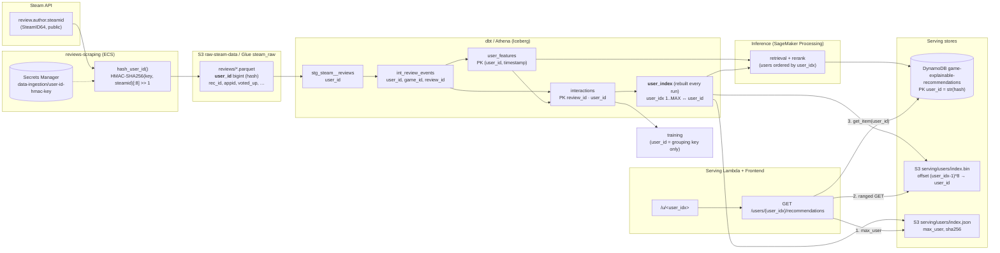
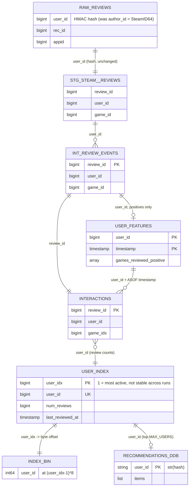

## Spec 13: Anonymized user ids + a demo user index

### Problem

`user_id` is the raw SteamID64 everywhere. The reviews scraper stores `author["steamid"]` as
`author_id`, and dbt only casts it (`stg_steam__reviews.user_id`). That id then becomes the key
of the `interactions` and `user_features` marts, the DynamoDB `game-explainable-recommendations`
table, the serving route `/users/{steam id}` and the frontend `/u/<steam id>`. A SteamID64
resolves to a public profile (`steamcommunity.com/profiles/<id>`), so any export of the marts
(e.g. a Kaggle mirror) would publish which identifiable people reviewed what, and when.

Goals:

1. No SteamID64 is stored anywhere: not in raw S3, the marts, DynamoDB or the serving
   artifacts. The pipeline's single `user_id` is a keyed hash, stable across runs.
2. A dense, activity-ordered `user_idx` (1 = most active … `MAX_USER` = least active), used only
   to make demo queries easy (`/u/1`, `/u/2`, …). It is never a join key in the ETL, training or
   inference.

### Hashed `user_id` (the only user key)

- `user_id = int.from_bytes(HMAC-SHA256(key, str(steamid)).digest()[:8], "big") >> 1`: a
  63-bit non-negative integer, so it stays `bigint` in every schema, still matches the digit
  patterns in serving and the frontend, and training and inference keep their int64 arrays.
  Collisions are negligible (~1e-7 at 1M users).
- HMAC, not a plain salted hash: without the key, the ~2^32 range of real SteamIDs can't be
  enumerated to rebuild the mapping.
- Key: Secrets Manager `data-ingestion/user-id-hmac-key` (32 random bytes, base64; created by
  Terraform with `random_password`, so it is never typed by hand). It is read only by
  `reviews-scraping` and the one-off migration task.
- **The key is never rotated.** A new key would split every user's history between the old and
  new ids. Rotating it means re-running the migration over all raw data (see below) and a full
  refresh. Losing it is less severe: existing data stays consistent, but new reviews from known
  users can no longer be linked to their history. The secret has `recovery_window_in_days = 30`
  and `prevent_destroy`.
- The model never learns a per-user embedding: the user tower embeds game ids, and `user_id` is
  only a grouping key. The champion therefore needs no retraining.

### Ingestion: hash at the source

- `reviews_scraping/scraper.py` hashes the id when it parses a review (new
  `steam_ingestion/anonymize.py`: `hash_user_id(steamid: int, key: bytes) -> int`). The raw
  SteamID never reaches a parquet file or a log line.
- `ReviewRecord.author_id` is renamed to `user_id`, as are the raw schema (`schemas.py`) and the
  Glue table `steam_raw.reviews`. The rename makes any consumer that still expects a SteamID
  fail loudly instead of silently reading hashes.
- Config: `UserIdHashSettings` (Pydantic), with `user_id_hmac_key: SecretStr` loaded from the
  secret at startup. The task fails to start without the secret: it never falls back to the raw
  id.
- `reviews-state-cursor` and `game-ids-state` hold no user ids (unchanged).

### Migration of existing raw data (one-off)

- New entrypoint `python -m steam_ingestion.anonymize_raw_reviews`. It uses the same image and
  runs as a one-off ECS `run-task` from the `data-ingestion CD` workflow (`workflow_dispatch`
  input `anonymize_raw=true`).
- For every `raw-steam-data-*/reviews/*.parquet`: read it, replace `author_id` with the hashed
  `user_id`, write it to the same key and verify the row count. Files that already have a
  `user_id` column are skipped, so the task is idempotent and resumable. Files are processed in
  parallel (`MIGRATION_WORKERS`).
- The raw bucket has no versioning (only `model-artifacts` does), so overwriting purges the
  SteamIDs. The task ends by asserting that no `reviews/` object still has an `author_id`
  column.
- The scheduled pipeline is disabled during the migration (EventBridge rule off), so no
  scraper writes mixed files.

### ETL

- `stg_steam__reviews`: `user_id` is read as is (no more `cast(author_id …)`), and the column
  docs say "keyed hash of the Steam author id (spec 13)".
- `interactions`, `user_features` and `int_review_events`: no SQL change; same column, new
  values. One `dbt run --full-refresh` rebuilds them under the new ids.
- **New mart `user_index`** (a plain Iceberg `table`, rebuilt every run, not incremental):

  | column             | type        | meaning                                                          |
  |--------------------|-------------|------------------------------------------------------------------|
  | `user_idx`         | bigint      | 1 = most active … `count(*)` = least active                      |
  | `user_id`          | bigint      | hashed id (unique)                                               |
  | `num_reviews`      | bigint      | reviews in `interactions` (kept games)                           |
  | `num_positive`     | bigint      | positive reviews                                                 |
  | `last_reviewed_at` | timestamp(6)| latest review                                                    |
  | `_batch_at`        | timestamp(6)| run timestamp                                                    |

  `user_idx = row_number() over (order by num_reviews desc, user_id)`. This is the same order
  inference already uses (`Activity.most_active` and `select_rerank_users`: most reviews first,
  ties by lowest id, over `interactions`), so the index and the scored or reranked users agree.
  The ordering is total, so a rebuild over the same data gives the same numbers.
- **`user_idx` is not stable across runs**: new reviews reorder users. This is acceptable for
  demo queries and is stated in the mart docs. It must not be stored next to anything
  persistent: it is not in the recommendations items or the training data, and not in a future
  Kaggle mirror (which uses the stable hashed `user_id`).
- Tests: `unique` + `not_null` on both ids, and a singular test that `user_idx` is exactly
  `1..count(*)` (no gaps).

### Inference: publish the index for serving

- After writing the recommendations, inference reads `user_index` ordered by `user_idx` and
  writes:
  - `s3://model-artifacts-*/serving/users/index.bin`: the `user_id`s as little-endian int64 in
    `user_idx` order. User `i` sits at byte offset `(i - 1) * 8`. That is 8 MB per million
    users, rewritten every run.
  - `s3://model-artifacts-*/serving/users/index.json`: a `UserIndexManifest` (Pydantic,
    contract in `inference/contracts.py`, mirrored in serving): `max_user`, `generated_at`,
    `bin_key`, `bin_sha256`. It is written after the `.bin`, so a reader never sees a manifest
    newer than its data.
- Lifecycle rule on `serving/users/`: noncurrent versions expire after 7 days (the bucket is
  versioned).
- Rerank selection (`select_rerank_users`) and `MAX_USERS` (`Activity.most_active`) already
  use this order, so the reranked users are the top of the index, apart from the users skipped
  for having fewer than `RERANK_MIN_REVIEWS` reviews or no positive review. That makes
  `/u/1`…`/u/1000` a ready-made demo range. A test asserts that the inference order and the
  mart order agree on a synthetic dataset. Users past `MAX_USERS`, or with no positive review,
  fall back to popularity in serving.

### Serving

- The route becomes `GET /users/{user_idx}/recommendations`, with `user_idx` matching
  `^[1-9][0-9]{0,9}$`. Resolving it:
  1. `index.json`, cached per container for `USER_INDEX_TTL_SECONDS` (300). If
     `user_idx > max_user`, return 404 `unknown user`.
  2. A ranged `GetObject` on `index.bin`, `Range: bytes=(i-1)*8-(i*8-1)`, gives the `user_id`.
  3. DynamoDB `get_item(user_id=str(user_id))` as today, with the same popularity fallback.
- Response: adds `user_idx` and `max_user`, and keeps `user_id` (now the hash, harmless).
  Contracts are updated in `serving/contracts.py` and `frontend/src/api.ts`.
- IAM: `s3:GetObject` on `serving/users/*`.
- The SteamID lookup is dropped on purpose. If serving could hash an incoming SteamID, anyone
  could look up a real person's activity through the public site, which undoes the
  anonymization.

### Frontend

- `/u/<user_idx>` (pattern `^[1-9][0-9]{0,9}$`). The header shows "Usuario #12 de 1.234.567"
  with ← / → links to the neighbours, plus a "usuario al azar" link (`1..min(max_user, 1000)`,
  the reranked range).
- README demo table: the five SteamIDs are replaced by "pick any of `/u/1`…`/u/1000`". Fixed
  numbers would point to different users after the next run.

### Diagram: how user ids flow and relate

### Tests

- `data_ingestion`: `hash_user_id` is deterministic, 63-bit, non-negative and key-dependent
  (known vector); the scraper output has no `author_id` and no raw id; the migration is
  idempotent (a second run skips files), keeps row counts and fails on a leftover `author_id`.
- `etl`: dbt tests above; a seed-based unit test that ties and ordering produce the expected
  `user_idx`.
- `inference`: `index.bin` round-trip (offset → id); the manifest is written after the bin;
  the `user_index` order matches `Activity.most_active` / `select_rerank_users`.
- `serving`: idx → id via a stubbed S3 range read, `> max_user` → 404, a bad pattern → 400,
  manifest TTL caching.
- `frontend`: route parsing of `/u/<idx>`, prev / next bounds.

### Rollout

1. Disable the EventBridge schedule.
2. Infrastructure apply: secret + key, Glue `reviews.user_id`, serving IAM, S3 lifecycle.
3. Data-ingestion CD (new scraper), then the migration run (`anonymize_raw=true`), which
   asserts that no `author_id` is left.
4. ETL CD, then one `dbt run --full-refresh` (rebuilds every user-keyed mart).
5. Inference CD with `run_now` and **`MAX_USERS=0`**: rekeys DynamoDB. Users that are gone are
   deleted only on full runs (inference invariant), and that deletion removes every SteamID
   key. The run also publishes `serving/users/`. Later runs can go back to a capped
   `MAX_USERS`.
6. Serving + frontend CD. Re-enable the schedule.
7. Check: scan DynamoDB for 17-digit `user_id`s starting with `7656119` (the SteamID64 shape),
   which must find none, and run an Athena check on `steam_raw.reviews`.

Between steps 3 and 6, `/u/<steam id>` links break. That's accepted (a demo app).

### Out of scope

- The Kaggle mirror (a later spec; it exports the hashed `user_id`, never `user_idx`).
- Review text: it stays in the private raw bucket and is not anonymized (it can contain names).
  The Kaggle spec decides whether to export it.
- SteamIDs already in git history (README / tests): they are public profiles and were
  published deliberately. New docs and tests use synthetic ids.
- Cleaning up the existing Kaggle dataset: a manual step (see the note in the PR / chat).
